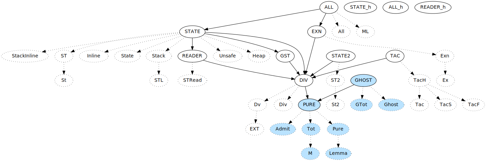

| Feature                           | Style                     |
| ---                               | ---                       |
| Total                             | blue backgound            |
| Alias effect, i.e. `effect A = B` | dotted node, dotted arrow |
| Reifiable effect                  | Rectangle                 |
| Reflectable                       | Thick green border        |
| `sub_effect A = B`                | Yellow arrow              |

